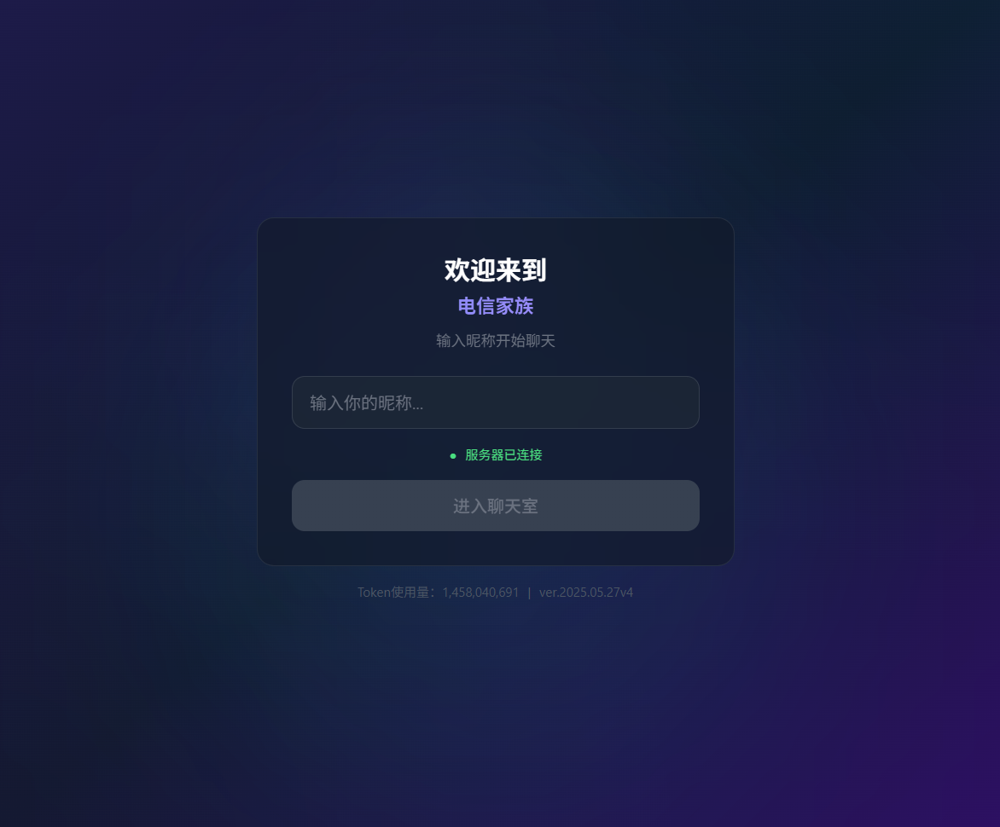
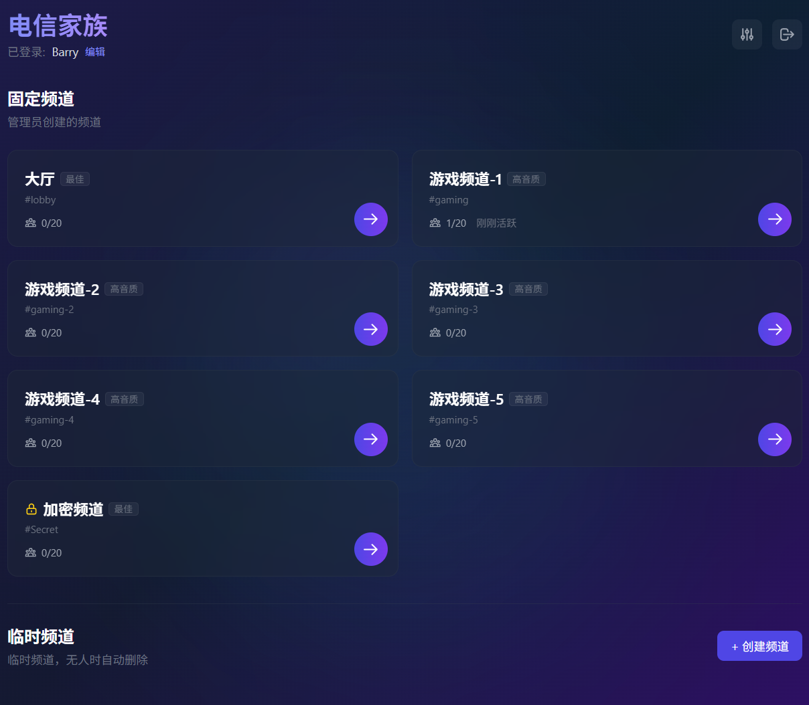
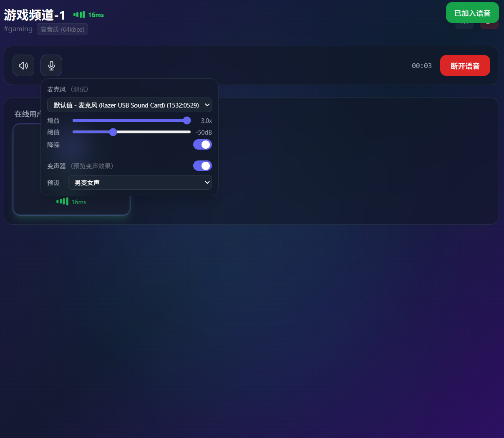
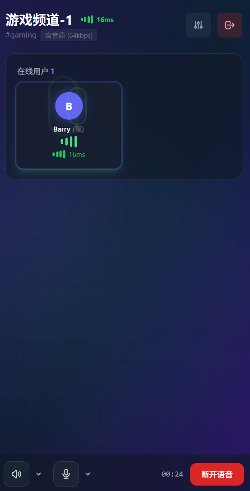

# 语音聊天室 (Voice Chat Room)

[English](./README_EN.md)

一个**无注册**的实时多人语音聊天室，支持频道系统、变声器、降噪和音量控制。

> 本项目**完全通过** [Opencode](https://opencode.ai) + **DeepSeek V4 Pro**，以 Vibe Coding 方式开发。
> 详细开发规范见 [AGENTS.md](./AGENTS.md)。

## 功能

- **匿名语音聊天** — 无需注册，基于 FingerprintJS 设备 ID 登录
- **多频道** — 默认大厅 + 管理员/用户可创建自定义频道，支持密码保护
- **变声器** — 18 种内置预设（男变女、女变男、萝莉、机器人等），基于 Tone.js
- **变声预览** — 开启前可录音 5 秒试听各预设效果
- **麦克风测试** — 一键录音并通过当前音频链路（增益 + 变声器）回放
- **实时降噪** — 基于 RNNoise WASM 的 AI 降噪，可选开关
- **噪声门** — 阈值可调（-60 ~ -30dB），避免环境噪音触发
- **独立音量调节** — 每个远端用户可单独调节音量（0.1 ~ 1.0）
- **说话指示器** — 绿色光环 + 音频波纹动画
- **权限管理** — 管理员可踢人、禁言、封禁、强制关麦
- **公告系统** — 全站公告 + 房间公告
- **响应式设计** — 桌面 / 移动端适配

## 界面截图

| 登录 | 频道列表 |
|------|----------|
|  |  |

| 频道内 | 移动端 |
|--------|--------|
|  |  |

## 技术栈

| 层级 | 技术 |
|------|------|
| 前端 | React 18 + TypeScript + Vite + TailwindCSS + Zustand |
| 实时通信 | Socket.io + Mediasoup (WebRTC SFU) |
| 音频处理 | Tone.js (变声器) + simple-rnnoise-wasm (降噪) |
| 后端 | Node.js + Express + Mediasoup 3.x |
| 数据库 | MongoDB + Mongoose |
| 部署 | Docker + Docker Compose (Mongo + Backend + Nginx) |

## 快速开始（本地开发）

```bash
# 1. 后端（nodemon 热重载）
cd backend && npm run dev

# 2. 前端（Vite HMR）
cd frontend && npm run dev
```

- 后端：`http://localhost:3001`（健康检查：`/health`）
- 前端：`https://localhost:5173`（局域网自动检测 IP）
- 开发环境 MongoDB 自动使用 `mongodb-memory-server`，无需额外安装

### ⚠️ 浏览器安全策略

除 `localhost` 和 `127.0.0.1` 外，现代浏览器获取麦克风权限**必须**使用 HTTPS/WSS 传输。解决方案：

1. **正式部署** — 绑定域名，申请 SSL/TLS 证书（Let's Encrypt 等）。
2. **局域网调试** — 伪造本地证书并跳过浏览器警告（Vite 开发服务器默认使用自签名证书）。
3. **Chrome 内核浏览器** — 访问 `chrome://flags/#unsafely-treat-insecure-origin-as-secure`，将局域网或公网地址加入白名单。

> 仅以 IP 地址为入口，即使申请了 SSL/TLS 证书，浏览器仍会弹出安全警告，需要用户自行跳过。

### 管理员界面

在网址后加上 `?admin` 后缀（如 `https://localhost:5173/?admin`），会出现 **⚙ 管理** 按钮。点击后输入管理员密码即可进入管理面板：

- 频道管理（创建 / 编辑 / 删除 / 排序）
- 用户管理（踢人 / 禁言 / 封禁 / 强制关麦）
- 公告发布
- 全局设置（站点名、变声器开关、频道限制等）

## 生产部署

```bash
# 1. 配置环境变量
cp deploy.conf.example deploy.conf
# 编辑 deploy.conf，填写公网 IP 和管理员密码

# 2. 一键部署（需要 Docker）
git pull && bash deploy.sh
```

### Docker 架构

```
┌─────────────────────────────────────────┐
│  docker compose                          │
│  ┌──────────┐ ┌──────────┐ ┌─────────┐  │
│  │ MongoDB  │ │ Backend  │ │  Nginx  │  │
│  │ :27017   │ │ :3001    │ │ :8080   │  │
│  └──────────┘ └──────────┘ └─────────┘  │
│                     ↑                    │
│              UDP 40000-49999            │
│              (Mediasoup RTP)            │
└─────────────────────────────────────────┘
```

- Backend 使用 `node:20-slim`（**不能**用 alpine，Mediasoup 不兼容 musl）
- Backend 绑定 `127.0.0.1:3001`，Nginx 绑定 `127.0.0.1:8080`
- 部署前需确保 RTP 端口（UDP 40000-49999）已开放
- 上层的反向代理（如 Nginx/Caddy）由用户自行配置到这两个端口

## 音频架构

```
麦克风 → 增益 → [变声器 (Tone.js)] → 分析器 → [降噪 (RNNoise)] → 噪声门 → SFU
                                                                           ↓
远端用户 ← <audio> ← GainNode ← MediaElementSource ← SFU Consumer
```

- 本地语音链：增益 → 变声器 → 降噪 → 噪声门 → Mediasoup Producer
- 远端音频：原生 `<audio>` 元素播放，通过 GainNode 调节音量
- 变声器预览/测试独立链路，不影响主音频流

## 项目结构

```
voice-chat-room/
├── frontend/               # React + TypeScript + Vite
│   └── src/
│       ├── components/     # UI 组件
│       │   ├── audio/      # 音频控件（变声器、预览、测试、音量）
│       │   ├── admin/      # 管理面板
│       │   ├── lobby/      # 频道大厅
│       │   └── room/       # 语音房间（用户卡片、网格）
│       ├── services/       # 音频服务层（变声器、降噪、预览）
│       ├── stores/         # Zustand 状态管理
│       ├── hooks/          # 自定义 Hooks
│       └── utils/          # 常量、预设、工具函数
├── backend/                # Node.js + Express + Socket.io
│   └── src/
│       ├── socket/         # Socket 事件处理
│       │   └── handlers/   # 登录、房间、管理员、Producer 处理
│       ├── mediasoup/      # WebRTC SFU 管理（Router、Observer）
│       ├── models/         # Mongoose 数据模型
│       └── services/       # 业务逻辑（频道、配置、封禁）
└── docker/                 # Docker 部署文件
    ├── docker-compose.yml
    ├── backend.Dockerfile
    └── frontend.Dockerfile
```

## 许可证

MIT

---

*Built with ❤️ by vibe coding using [Opencode](https://opencode.ai) + DeepSeek V4 Pro*
